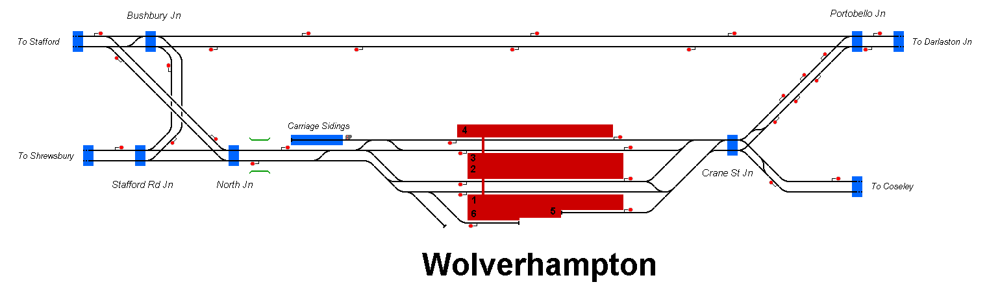

# Wolverhampton, West Midlands
This simulation covers the area around Wolverhampton within the county of the West Midlands in the UK. The provided timetable features a 4 hour interval in a morning of Spring 2025.

## Current Status

| Stage         | Status        |
| ------------- |:-------------:|
| Track Plan     | :heavy_check_mark: |
| Signalling      | :heavy_check_mark:      |
| Naming | :heavy_check_mark:      |
| Speed Limits | :x: |
| Distances | :x: |
| Timetable | :heavy_check_mark: |
| Documentation | :x: |

## Data Sources
- [Raildar](https://raildar.co.uk/)
- [OpenTrainTimes](https://www.opentraintimes.com/)
- [Traksy](https://traksy.uk/live)
